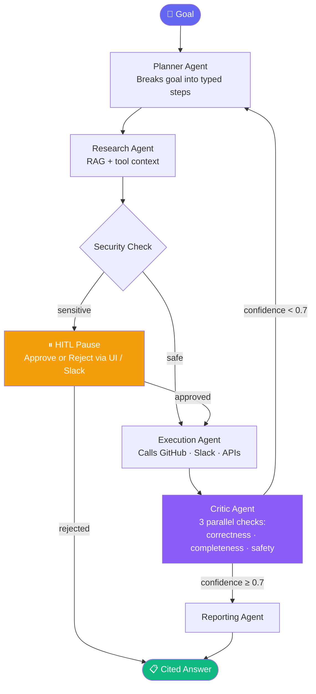

<div align="center">

<br/>

```
  ██████╗ ██████╗ ███████╗██████╗ ██╗██╗      ██████╗ ████████╗
 ██╔═══██╗██╔══██╗██╔════╝██╔══██╗██║██║     ██╔═══██╗╚══██╔══╝
 ██║   ██║██████╔╝███████╗██████╔╝██║██║     ██║   ██║   ██║   
 ██║   ██║██╔═══╝ ╚════██║██╔═══╝ ██║██║     ██║   ██║   ██║   
 ╚██████╔╝██║     ███████║██║     ██║███████╗╚██████╔╝   ██║   
  ╚═════╝ ╚═╝     ╚══════╝╚═╝     ╚═╝╚══════╝ ╚═════╝    ╚═╝   
```

### Autonomous AI Operations Copilot

**Give it a goal. It plans, researches, executes, verifies — and asks before it acts.**

<br/>

[](https://opspilot-frontend-production.up.railway.app)
&nbsp;
[](https://opspilot-backend-production.up.railway.app/docs)
&nbsp;
[](https://railway.app)

<br/>


<br/>

</div>

---

## What is OpsPilot?

OpsPilot is **not a chatbot**. It's an autonomous agent that takes a business *goal* and works through it end-to-end:

```
Goal → Plan → Research → Execute → Verify → Report
```

Sensitive actions (rollback deployment, restart service, create issues) **pause for human approval** before running — via the UI or Slack interactive buttons.

---

## How It Works



---

## Features

<table>
<tr>
<td width="50%">

**🤖 Multi-Agent Runs**
Planner → Research → Execution → Critic → Reporting. Self-reflects and retries when confidence is low.

**💬 Streaming Chat**
Tool-augmented copilot with persistent conversation memory. Streams tokens in real time.

**📄 RAG (Retrieval-Augmented Generation)**
Upload PDFs, Markdown, text. Hybrid dense + BM25 search. Agent cites every source `[1]`.

**🐙 GitHub Integration**
17 tools — list/create issues, PRs, commits, releases, file contents, webhooks, and more.

</td>
<td width="50%">

**💬 Slack Integration**
Bidirectional bot via Socket Mode. Keyword alerts, event triggers, HITL approval buttons.

**👤 Human-in-the-Loop**
Sensitive actions pause the run. Approve or reject from the dashboard or a Slack button.

**🔌 MCP Tool Registry**
Pluggable tool ecosystem. Add any new tool with one file + one config line.

**📊 Observability**
Prometheus metrics · Grafana dashboard · LangSmith tracing · Celery async workers.

</td>
</tr>
</table>

---

## Tech Stack

| Layer | Technology |
|-------|-----------|
| **Backend** | Python 3.11 · FastAPI (async) · LangGraph · Pydantic |
| **Agent Memory** | SQLAlchemy · Alembic · PostgreSQL (Supabase) |
| **Cache / Jobs** | Redis (Upstash) · Celery · Celery Beat |
| **LLM** | OpenRouter — swappable via `LLMProvider` interface · Ollama supported |
| **Vector DB** | Qdrant Cloud — hybrid dense (`bge-small-en`) + sparse (BM25) |
| **Security** | RBAC · injection guardrails · secrets redaction · rate limiting |
| **Frontend** | React 19 · Vite 5 · streaming SSE |
| **Deployment** | Railway · Docker |
| **Observability** | Prometheus · Grafana · LangSmith |

---

## Quick Start

### Prerequisites
- Python 3.11+ · Node.js 18+
- PostgreSQL, Redis, Qdrant (or cloud: Supabase, Upstash, Qdrant Cloud)

### 1. Backend

```bash
pip install -r backend/requirements.txt
cp .env.example .env          # fill in your keys
uvicorn backend.main:app --reload --port 8000
```

### 2. Frontend

```bash
cd frontend
npm install
echo 'VITE_API_URL=http://localhost:8000' > .env.local
npm run dev                   # http://localhost:5173
```

### 3. Background Workers (optional)

```bash
# Celery worker + Beat scheduler
celery -A backend.workers.celery_app worker --loglevel=info
celery -A backend.workers.celery_app beat   --loglevel=info

# Slack bot (Socket Mode)
python -m backend.workers.slack_bot
```

---

## API Reference

> **Base URL:** `https://opspilot-backend-production.up.railway.app`  
> All endpoints require `Authorization: Bearer <token>` after login.

| Method | Endpoint | Auth | Description |
|--------|----------|------|-------------|
| `POST` | `/v1/auth/register` | — | Register new user |
| `POST` | `/v1/auth/login` | — | Login → JWT token |
| `POST` | `/v1/chat/stream` | viewer+ | Streaming chat (SSE) |
| `POST` | `/v1/runs` | operator+ | Start a multi-agent run |
| `GET` | `/v1/runs` | viewer+ | List all runs |
| `GET` | `/v1/runs/{id}` | viewer+ | Run detail + tool call log |
| `POST` | `/v1/documents` | operator+ | Upload document for RAG |
| `POST` | `/v1/documents/ask` | viewer+ | Cited question answering |
| `GET` | `/v1/mcp/tools` | viewer+ | List all registered tools |
| `GET` | `/v1/approvals` | viewer+ | Pending HITL approvals |
| `POST` | `/v1/approvals/{id}` | operator+ | Approve or reject action |
| `POST` | `/v1/integrations/{service}` | operator+ | Save integration token |
| `GET` | `/metrics` | — | Prometheus metrics |

Full interactive docs at `/docs`.

---

## Project Structure

```
.
├── backend/
│   ├── agents/          # Planner · Research · Execution · Critic · Reporting · Copilot
│   ├── api/routes/      # FastAPI route handlers (chat · runs · docs · approvals · …)
│   ├── auth/            # JWT · RBAC · API key gate
│   ├── core/            # Orchestrator · HITL · LangGraph workflow · reflection
│   ├── db/              # SQLAlchemy models · Alembic migrations
│   ├── integrations/    # Encrypted token store · Google OAuth
│   ├── llm/             # LLMProvider interface · OpenRouter · Ollama
│   ├── mcp/             # Tool registry · MCP servers
│   ├── observability/   # Prometheus metrics · LangSmith tracing
│   ├── rag/             # Chunker · embeddings · Qdrant · hybrid retriever
│   ├── security/        # RBAC · injection guardrails · secrets redaction
│   ├── tools/           # 20+ tool implementations
│   └── workers/         # Celery · Slack bot · webhook handler
│
├── frontend/
│   └── src/
│       ├── components/  # Chat · Runs · Settings · Documents · Approvals · …
│       ├── api.js       # Fetch helpers · auth token management
│       └── App.jsx      # Layout · routing · health polling
│
├── infrastructure/
│   └── monitoring/      # Prometheus config · Grafana dashboard JSON
│
└── docker-compose.yml   # Local dev: Postgres · Redis · Qdrant · Grafana
```

---

## Environment Variables

See `.env.example` for the full list. Key variables:

| Variable | Required | Description |
|----------|----------|-------------|
| `DATABASE_URL` | ✅ | PostgreSQL connection string |
| `REDIS_URL` | ✅ | Redis URL — use `rediss://` for TLS (Upstash) |
| `QDRANT_URL` + `QDRANT_API_KEY` | ✅ | Qdrant Cloud endpoint and key |
| `OPENROUTER_API_KEY` | ✅ | Default LLM key (users can add their own) |
| `OPENROUTER_MODEL` | ✅ | Model ID — e.g. `openai/gpt-4o` |
| `JWT_SECRET` | ✅ | Secret for signing user session tokens |
| `ENCRYPTION_KEY` | ✅ | Fernet key for integration tokens at rest |
| `API_KEY` | — | Optional Bearer token to gate the entire API |
| `GITHUB_TOKEN` | — | Default GitHub token (per-user tokens override) |
| `GITHUB_WEBHOOK_SECRET` | — | HMAC secret for webhook validation |
| `SLACK_BOT_TOKEN` | — | Slack bot token (`xoxb-`) |
| `SLACK_APP_TOKEN` | — | Socket Mode token (`xapp-`) |
| `SLACK_SIGNING_SECRET` | — | For verifying Slack interactive payloads |
| `GOOGLE_CLIENT_ID/SECRET` | — | Google OAuth credentials |
| `LANGSMITH_API_KEY` | — | LangSmith tracing (optional) |

---

<div align="center">

**Built with Python · FastAPI · LangGraph · React**

<sub>Private — All rights reserved</sub>

</div>
